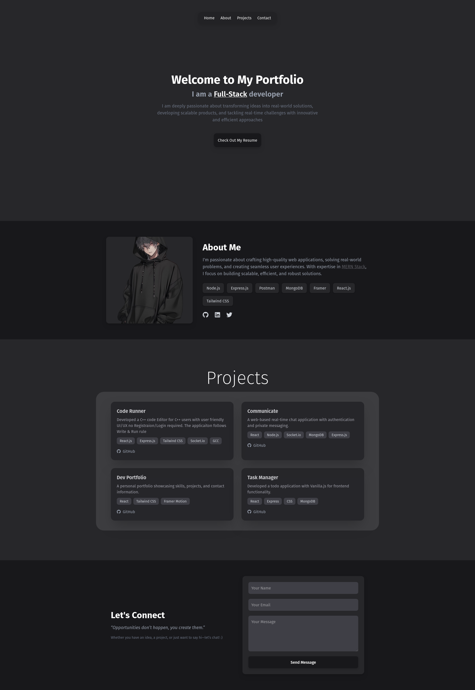

# 🚀 My Portfolio

A sleek, modern portfolio showcasing my work, built with **React.js, Tailwind CSS, and Framer Motion**.

## ✨ Features

- Dark-themed minimal UI
    
- Smooth animations using Framer Motion
    
- Responsive design
    
- Interactive project showcase
    
- Social media and contact links
    

## 🛠 Built With

- **React.js** – Frontend framework
    
- **Tailwind CSS** – Utility-first styling
    
- **Framer Motion** – Smooth animations
    
- **Vercel** – Hosting and deployment
    

## 📌 Live Demo

🔗 **[View My Portfolio](https://portfolio-m36s.onrender.com)**

## 📂 Installation & Running Locally

If you want to run the project locally, follow these steps:

1. Clone the repository
    
    ```sh
    git clone https://github.com/your-username/portfolio.git  
    ```
    
2. Navigate to the project directory
    
    ```sh
    cd portfolio  
    ```
    
3. Install dependencies
    
    ```sh
    npm install  
    ```
    
4. Start the development server
    
    ```sh
    npm run dev  
    ```
    

## 🖼 Screenshot



## 📬 Contact

- **GitHub**: [@Adam](https://github.com/adam-dev2)
    
- **LinkedIn**: [@Adam](https://www.linkedin.com/in/shaik-adam-222328230/)
    
- **Twitter/X**: [@Adam](https://x.com/dev_adam2)
    

---

Built with passion and a love for clean, modern UI! Hope you like it! ✨